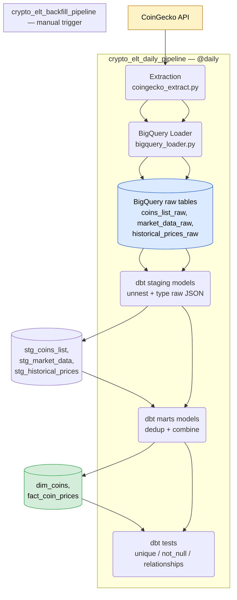
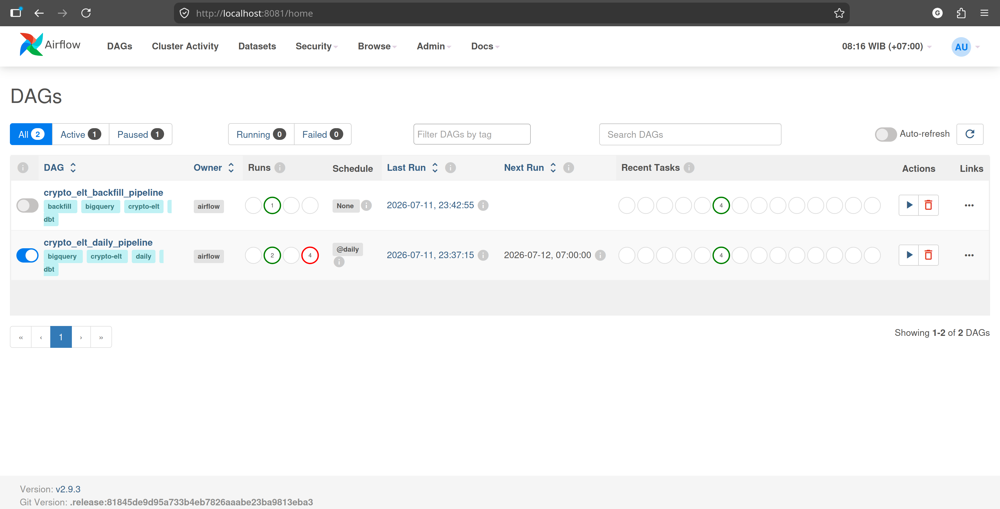
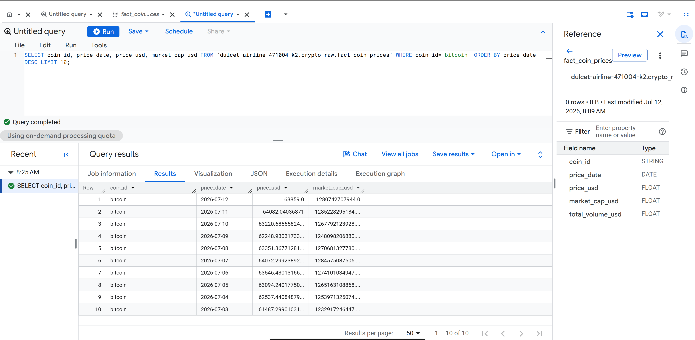

# crypto-market-elt

A cloud native ELT pipeline that extracts daily and historical cryptocurrency market data from the CoinGecko API, loads it into Google BigQuery as is, transforms it with dbt, and is orchestrated by two independent Apache Airflow DAGs all fully containerized with Docker.

---

## Table of Contents

- [Overview](#overview)
- [Features](#features)
- [Architecture](#architecture)
- [Project Structure](#project-structure)
- [Tech Stack](#tech-stack)
- [Design Trade-offs](#design-trade-offs)
- [Installation](#installation)
- [Configuration](#configuration)
- [Running the Pipeline](#running-the-pipeline)
- [Data Quality](#data-quality)
- [Data Model](#data-model)
- [CI/CD](#cicd)
- [Service URLs](#service-urls)
- [Troubleshooting](#troubleshooting)
- [License](#license)
- [Author](#author)

---

## Overview

This project ingests cryptocurrency market data from the [CoinGecko API](https://docs.coingecko.com/) and turns it into a queryable, tested BigQuery dataset, with a clean separation between a **daily incremental load** and a **one-time historical backfill** the same operational split used in its companion project, [`crypto-market-pipeline`](https://github.com/gladytdavianus/crypto-market-pipeline), but built around the opposite philosophy: **ELT instead of ETL**.

Each pipeline run performs:

1. **Extract** — fetch coin metadata (`/coins/list`) and either today's price snapshot (`/coins/markets`) or 365 days of history (`/coins/{id}/market_chart`)
2. **Load** — write the raw JSON response into BigQuery untouched, as a native `JSON` column (landing zone pattern) no parsing happens in Python
3. **Transform (staging)** — dbt models unnest and type the raw JSON into clean, columnar tables
4. **Transform (marts)** — dbt models combine staging tables into analysis-ready `dim_coins` and `fact_coin_prices`
5. **Test** — dbt tests validate uniqueness, non null constraints, and referential integrity before the data is considered trustworthy

---

## Features

- Two independent Airflow DAGs: a daily snapshot (`@daily`) and a manually triggered historical backfill each fully re-runnable on a fresh BigQuery dataset
- Raw API responses stored as native BigQuery `JSON` columns, not pre-parsed transformation logic lives entirely in version controlled, testable SQL (dbt), not in Python
- Deduplication logic in the marts layer reconciles overlapping data between the daily snapshot and historical backfill sources, keyed on `(coin_id, price_date)`
- dbt test suite: `unique`, `not_null`, `relationships` (foreign key integrity), and a multi column uniqueness test via `dbt_utils`
- Fully containerized with Docker Compose Airflow image built with Poetry, no JVM required
- CI (lint + dbt validation) and dbt tests running against live BigQuery data via GitHub Actions
- Companion project to [`crypto-market-pipeline`](https://github.com/gladytdavianus/crypto-market-pipeline), demonstrating the same problem solved with two different architectural philosophies (ETL vs ELT)

---

## Architecture



---

## Project Structure

```
crypto-market-elt/
│
├── .github/
│   └── workflows/
│       ├── lint.yml                       ← CI: black, isort, ruff on every push
│       └── dbt-ci.yml                     ← CI: dbt parse + dbt test against live BigQuery
│
├── dags/
│   ├── crypto_elt_daily_pipeline.py       ← @daily: snapshot extract -> dbt run -> dbt test
│   └── crypto_elt_backfill_pipeline.py    ← manual trigger: 365-day history -> dbt run -> dbt test
│
├── extraction/
│   ├── coingecko_extract.py               ← CoinGecko API calls (reused from crypto-market-pipeline)
│   ├── bigquery_loader.py                 ← loads raw JSON payloads into BigQuery, as-is
│   ├── config.py                          ← environment variable loader
│   └── logger.py                          ← console + file logger
│
├── dbt_project/
│   ├── models/
│   │   ├── staging/
│   │   │   ├── sources.yml                ← declares the 3 raw BigQuery tables as dbt sources
│   │   │   ├── stg_coins_list.sql
│   │   │   ├── stg_market_data.sql
│   │   │   └── stg_historical_prices.sql
│   │   └── marts/
│   │       ├── schema.yml                 ← dbt tests: unique, not_null, relationships
│   │       ├── dim_coins.sql
│   │       └── fact_coin_prices.sql
│   ├── packages.yml                       ← dbt_utils
│   └── dbt_project.yml
│
├── docs/
│   └── screenshots/
│       ├── airflow-dag-success.png        ← both DAGs succeeding in the Airflow UI
│       └── bigquery-query-results.png     ← sample query result from fact_coin_prices
│
├── credentials/                            ← gitignored: service account JSON key
├── logs/                                    ← gitignored: Airflow task logs
├── Dockerfile                               ← Airflow image with Poetry (no JVM)
├── docker-compose.yml
├── pyproject.toml
├── .env.example
└── LICENSE
```

---

## Tech Stack

| Layer | Technology | Version |
|---|---|---|
| Language | Python | 3.12 |
| Dependency management | Poetry | — |
| Data source | CoinGecko API | Demo tier |
| Data warehouse | Google BigQuery | Sandbox (free tier) |
| Transformation | dbt-bigquery | 1.11.x |
| Orchestration | Apache Airflow (TaskFlow API) | 2.9.3 |
| Containerization | Docker + Docker Compose | — |
| Testing | dbt tests + dbt_utils | — |
| CI/CD | GitHub Actions | — |

---

## Design Trade-offs

This project is a deliberate architectural counterpart to [`crypto-market-pipeline`](https://github.com/gladytdavianus/crypto-market-pipeline), built to demonstrate ELT where the companion project demonstrates ETL — using the same CoinGecko data source for a direct comparison.

- **BigQuery Sandbox (free tier), not a billed project.** This project intentionally runs without a billing account enabled, to avoid any cost risk for a portfolio/learning project. The trade-off: BigQuery Sandbox enforces a **60-day default table expiration** that cannot be disabled without enabling billing. In practice this is mitigated by the daily Airflow DAG, which keeps re-populating the raw and downstream tables on a schedule the pipeline stays demonstrably functional even though very old raw snapshots eventually expire. Enabling billing (GCP offers free credit for new accounts) would remove this limit entirely; it was a deliberate trade off avoided here to keep the project genuinely free to run.
- **Raw JSON stored as-is (landing zone pattern), not flattened in Python.** API responses are loaded into BigQuery untouched as native `JSON` columns, and all parsing/typing happens later in dbt staging models via `JSON_EXTRACT_SCALAR` and `UNNEST`. This keeps extraction code minimal and puts transformation logic in SQL, where it's version controlled, testable, and self documenting this is the core idea ELT is built around, and the main philosophical difference from `crypto-market-pipeline`, where PySpark transforms and validates data *before* it is loaded.
- **No PostgreSQL for pipeline data.** Unlike `crypto-market-pipeline`, this project has no self hosted database for application data BigQuery serves that role entirely. PostgreSQL is only present as Airflow's own internal metadata store (DAG run history, task state), which is incidental infrastructure Airflow itself requires, not a project design choice.
- **No PySpark.** CoinGecko market data at this scale (a curated set of coins, daily granularity, a couple of years of history) doesn't approach the volume where a distributed compute engine earns its complexity. `crypto-market-pipeline` uses PySpark deliberately as a learning exercise even though it's arguably over engineered for this data size see that project's own Design Trade offs section. This project takes the opposite, right sized approach: let BigQuery's own distributed SQL engine handle transformation, since it already scales far beyond what either project's dataset requires.

---

## Installation

### Prerequisites

| Requirement | Minimum Version | Notes |
|---|---|---|
| Docker | 24.0+ | Engine + CLI |
| Docker Compose | 2.20+ | `docker-compose-plugin` package on Linux — no Docker Desktop required |
| Git | any | For cloning the repo |
| Poetry | 1.8+ | Optional, only needed for local development outside containers |
| Google Cloud account | — | Free tier (BigQuery Sandbox), no credit card required |

### Step-by-Step Setup

**1. Clone the repository**

```bash
git clone git@github.com:gladytdavianus/crypto-market-elt.git
cd crypto-market-elt
```

**2. Set up a GCP project and BigQuery dataset**

- Create a GCP project and enable the BigQuery API
- Create an empty dataset (default: `crypto_raw`)
- Create a service account with the `BigQuery Data Editor` and `BigQuery Job User` roles
- Generate a JSON key for the service account and save it to `credentials/crypto-elt-sa.json` (gitignored)

**3. Configure environment variables**

```bash
cp .env.example .env
echo "AIRFLOW_UID=$(id -u)" >> .env
```

Edit `.env` and fill in your own values: `GCP_PROJECT_ID`, `COINGECKO_API_KEY` (free — [register here](https://www.coingecko.com/en/developers/dashboard)), and `AIRFLOW__WEBSERVER__SECRET_KEY` (generate with `python3 -c "import secrets; print(secrets.token_hex(16))"`).

**4. Configure the dbt profile**

Create `~/.dbt/profiles.yml` (outside the repo, so credentials never get committed):

```yaml
crypto_market_elt:
  target: dev
  outputs:
    dev:
      type: bigquery
      method: service-account
      project: your-gcp-project-id
      dataset: crypto_raw
      keyfile: "{{ env_var('GOOGLE_APPLICATION_CREDENTIALS') }}"
      threads: 4
      location: US
```

Using `env_var()` instead of a hardcoded path keeps this file portable between local development and the Airflow container, where the credential lives at a different path.

**5. Build and start all services**

```bash
docker compose up airflow-init
docker compose up -d airflow-webserver airflow-scheduler
```

The first build installs Poetry and all dependencies inside the Airflow image this takes a few minutes. Subsequent starts are fast.

**6. Verify all containers are healthy**

```bash
docker ps
```

You should see `crypto_elt_airflow_postgres`, `crypto-market-elt-airflow-webserver-1`, and `crypto-market-elt-airflow-scheduler-1` all `Up`.

---

## Configuration

### Environment Variables (`.env`)

| Variable | Description |
|---|---|
| `GCP_PROJECT_ID` | Your GCP project ID |
| `GCP_DATASET_RAW` | BigQuery dataset name (default `crypto_raw`) |
| `GOOGLE_APPLICATION_CREDENTIALS` | Path to the service account JSON key |
| `COINGECKO_BASE_URL` | `https://api.coingecko.com/api/v3` |
| `COINGECKO_API_KEY` | Free CoinGecko Demo API key |
| `AIRFLOW__WEBSERVER__SECRET_KEY` | Random secret for Airflow session security |
| `AIRFLOW_UID` | Host user ID — prevents file permission errors on mounted `dags/`, `logs/` volumes |

### Backfill coin selection (`extraction/coingecko_extract.py`)

```python
def extract_backfill(coin_ids: list[str] | None = None, days: int = 365):
    if coin_ids is None:
        coin_ids = ["bitcoin", "ethereum", "solana"]
```

Change the default list (or pass `coin_ids` explicitly) to backfill different coins.

---

## Running the Pipeline

### Trigger manually via Airflow UI

Open `http://localhost:8081` (login: `admin` / `admin`). Both DAGs start **paused** — unpause them from the UI before triggering or waiting for the schedule.

- `crypto_elt_backfill_pipeline` — run this first on a fresh dataset, to populate historical data
- `crypto_elt_daily_pipeline` — runs automatically every day; can also be triggered manually



### Run manually without Airflow (for local development)

```bash
cd extraction
poetry run python -c "from coingecko_extract import extract_daily; extract_daily()"

cd ../dbt_project
poetry run dbt run --select staging
poetry run dbt run --select marts
poetry run dbt test --select marts
```

---

## Data Quality

Rather than a custom validation layer, this project relies on dbt's built-in testing framework, run automatically as the last step of every DAG:

```bash
poetry run dbt test --select marts
```

| Test | Applied to | Purpose |
|---|---|---|
| `unique` | `dim_coins.coin_id` | No duplicate coins in the dimension table |
| `not_null` | `dim_coins.coin_id`, `fact_coin_prices.coin_id` / `price_date` / `price_usd` | No missing keys or prices |
| `relationships` | `fact_coin_prices.coin_id` → `dim_coins.coin_id` | Referential integrity between fact and dimension |
| `dbt_utils.unique_combination_of_columns` | `(coin_id, price_date)` on `fact_coin_prices` | Confirms the daily-snapshot / historical-backfill dedup logic actually produces one row per coin per day |

Example query against the resulting data:

```sql
SELECT coin_id, price_date, price_usd, market_cap_usd
FROM `your-project.crypto_raw.fact_coin_prices`
WHERE coin_id = 'bitcoin'
ORDER BY price_date DESC
LIMIT 10;
```



---

## Data Model

### `dim_coins` — coin metadata, sourced from `/coins/list`

| Column | Type | Description |
|---|---|---|
| `coin_id` | STRING | CoinGecko coin identifier (unique) |
| `symbol` | STRING | Ticker symbol |
| `name` | STRING | Full coin name |

### `fact_coin_prices` — daily price time-series, combining daily snapshots and historical backfill

| Column | Type | Description |
|---|---|---|
| `coin_id` | STRING, FK → `dim_coins` | Coin identifier |
| `price_date` | DATE | Date this price applies to |
| `price_usd` | FLOAT64 | Price in USD |
| `market_cap_usd` | FLOAT64 | Market cap |
| `total_volume_usd` | FLOAT64 | 24h trading volume |

`(coin_id, price_date)` is kept unique by a `qualify row_number()` dedup step in the marts model, which prioritizes the daily snapshot over historical backfill when both sources cover the same date.

---

## CI/CD

This project uses two separate GitHub Actions workflows:

| Workflow | File | Trigger | What it does |
|---|---|---|---|
| **Lint** | `.github/workflows/lint.yml` | Every push / PR | Runs `black`, `isort`, and `ruff` against `extraction/` and `dags/` |
| **dbt CI** | `.github/workflows/dbt-ci.yml` | Every push / PR | Runs `dbt parse` to validate all SQL compiles, then `dbt test --select marts` against live BigQuery data |

Unlike `crypto-market-pipeline`'s CD workflow (which builds and publishes a Docker image to GHCR using GitHub's built-in `GITHUB_TOKEN`), this project's dbt CI step authenticates to an external service Google BigQuery which has no equivalent built-in token. It requires two repository secrets:

| Secret | Value |
|---|---|
| `GCP_PROJECT_ID` | Your GCP project ID |
| `GCP_SA_KEY_JSON` | Base64-encoded contents of the service account JSON key: `base64 -w 0 credentials/crypto-elt-sa.json` |

This means every push is validated not just for code style, but for whether the dbt models actually still run correctly against real warehouse data closer to a true integration test than the syntax only checks in `crypto-market-pipeline`'s CI.

---

## Service URLs

| Service | URL | Credentials |
|---|---|---|
| Airflow UI | http://localhost:8081 | `admin` / `admin` |
| BigQuery Console | https://console.cloud.google.com/bigquery | Your Google account |
| PostgreSQL (Airflow metadata only) | internal only, not exposed to host | — |

---

## Troubleshooting

### 1. `ModuleNotFoundError: No module named 'config'`

**Cause:** `extraction/` has a flat structure with no `src/` package layout, so `config.py` is only importable relative to that folder. Running scripts from the repo root (or, in the Airflow container, from `/opt/airflow`) breaks the import.

**Solution:** For local runs, `cd extraction` before invoking Python. Inside the container, add the `extraction/` folder itself to `PYTHONPATH`:
```yaml
PYTHONPATH: /opt/airflow:/opt/airflow/extraction
```

---

### 2. `google.auth.exceptions.DefaultCredentialsError: File ./credentials/... was not found`

**Cause:** `GOOGLE_APPLICATION_CREDENTIALS` was set to a relative path, which resolves differently depending on the current working directory the script happens to run from.

**Solution:** Always use an absolute path for `GOOGLE_APPLICATION_CREDENTIALS` in `.env`.

---

### 3. `JSON_EXTRACT_ARRAY` / `UNNEST` returns no rows even though the raw table has data

**Cause:** The raw `payload` column was double encoded the loader called `json.dumps()` on the payload *and* the column was declared as native BigQuery `JSON` type, so BigQuery stored a JSON typed string containing escaped JSON text, not a real JSON array/object. `JSON_TYPE(payload)` returns `"string"` instead of `"array"` in this failure mode.

**Solution:** Pass the raw Python object directly to `load_table_from_json()` and let BigQuery serialize it do not pre-serialize with `json.dumps()` when the target column is typed as native `JSON`.

---

### 4. `PermissionError: [Errno 13] Permission denied: '/opt/airflow/logs/scheduler'`

**Cause:** The container's Airflow user UID doesn't match the host user that owns the mounted `logs/`/`dags/` folders — commonly because `AIRFLOW_UID` was left at its fallback value (`50000`) instead of the host's actual UID.

**Solution:**
```bash
echo "AIRFLOW_UID=$(id -u)" >> .env
docker compose down && docker compose up airflow-init
```

---

### 5. `KeyError: 'getpwuid(): uid not found: 1000'`

**Cause:** Overriding `entrypoint` on the `airflow-init` service (to run `db migrate` and `users create` in one shot) skips the base image's own entrypoint script, which is responsible for registering the container's UID with a username before Airflow starts.

**Solution:** Call the base entrypoint script explicitly for each command:
```yaml
command:
  - "/entrypoint airflow db migrate && /entrypoint airflow users create --username admin --password admin --firstname Admin --lastname User --role Admin --email admin@example.com || true"
```

---

### 6. `Error: Invalid value for '--profiles-dir': Path '/home/airflow/.dbt' does not exist`

**Cause:** `profiles.yml` lives outside the repo at `~/.dbt/profiles.yml` on the host (by dbt convention, so credentials never get committed) but that path is never mounted into the Airflow container by default.

**Solution:** Mount it explicitly, and reference the credential path via `env_var()` rather than a hardcoded host path, so the same `profiles.yml` works both on the host and inside the container:
```yaml
volumes:
  - ~/.dbt:/home/airflow/.dbt
```
```yaml
keyfile: "{{ env_var('GOOGLE_APPLICATION_CREDENTIALS') }}"
```

---

### 7. `BigQuery Sandbox: The default table expiration time must be less than 60 days`

**Cause:** This is an explicit BigQuery Sandbox restriction, not a bug a dataset with no billing account enabled cannot disable table expiration.

**Solution:** Accepted as a deliberate trade off see [Design Trade offs](#design-trade-offs). The daily Airflow DAG keeps the pipeline demonstrably functional regardless.

---

## License

This project is licensed under the MIT License — see the [LICENSE](LICENSE) file for details.

---

## Author

> Built and maintained by **Glady T. Davianus** — Instrument & Control Engineer transitioning into Data Engineering.

GitHub: [https://github.com/gladytdavianus](https://github.com/gladytdavianus)

> Contributions and pull requests are welcome.

---

## Acknowledgments

- [CoinGecko API](https://docs.coingecko.com/) — for free access to cryptocurrency market data
- [Google BigQuery](https://cloud.google.com/bigquery) — for serverless data warehousing
- [dbt](https://www.getdbt.com/) — for SQL-based transformation, testing, and documentation
- [Apache Airflow](https://airflow.apache.org/) — for workflow orchestration

---

*Last updated: July 2026*
